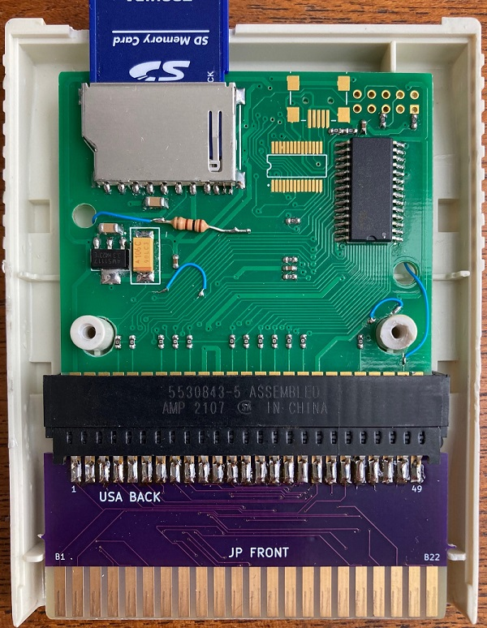

# sms2mk3

Play your US Sega Master System games on a Japanese console. 
The compact design of this board reduces its cost and allows for more flexibility in mounting compared to other options on the market.

The sms2mk3 has the correct vertical size to fit inside a Sega Mark III or Japanese SMS cartridge. It was initially designed to re-use a Japanese Mark III cartridge as housing for a first-generation (legacy) Krikzz Master Everdrive. The design has been tested and confirmed to work for this use case.

Due to the recessed backs of these cartrdiges, case cutting may be necessary to fit the cartrdige slot. Alternatively, you can use the quick-solder board to permanently affix your US cartridge to the converter board, and you will be able to fit it all inside a Japanese Sega cartridge without external case cuts.

## Future goals

This project would most effectively be used with a newly manufactured plastic shell which has had its mounting extrusions correctly aligned with the screw holes on a US Master System game PCB. This would allow for a direct fit of the game and converter PCB assembly inside the housing. i haven't attempted 3D modeling the shell yet.
